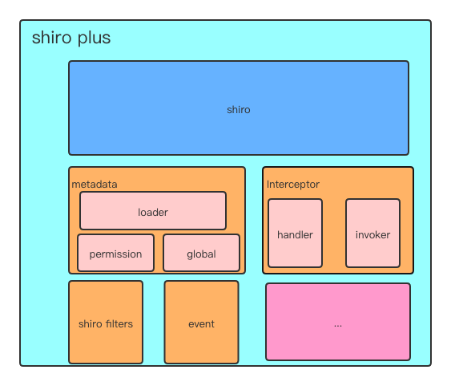

# shiro-plus

#### 介绍
#####一款shiro的加强版框架，它提供了如下功能
- 动态授权 （根据远程或本地配置对访问接口进行权限动态调整）
- 对shiro 原生授权放松进行了完美的适配
- 支持 web 和 aop动态授权的场景同事也提供了shiro原生的授权方式
- 可以对授权类型进行高度的扩展
- 提供了shiro filter和spring容器中的filter隔离，同时也支持spring bean 方式的注册
- 和spring boot完美的集成，真正实现"零配置"
- 提供了多租户的支持


#### 软件架构



#### 安装说明

1. 

```bash
git clone https://gitee.com/kiangning/shiro-plus.git
mvn clean package
```

2. 将jar包引入自己的项目

#### 项目结构

- shiro-authorize：动态授权
- shiro-example：示例工程
- shiro-springboot： spring boot的集成，模块化开发

#### 依赖说明

| 项目             | 依赖版本      |
| ---------------- | ------------- |
| spring framework | 5.2.0.RELEASE |
| spring boot      | 2.2.0.RELEASE |
| shiro            | 1.5.1         |

使用说明

#### 使用说明

##### 快速开始

1. 启动类

```java
@EnableShiroPlus
@SpringBootApplication
public class Application {

	public static void main(String[] args) {
		SpringApplication.run(Application.class , args);
	}
}
```

2. 定义一个Realm 否则在鉴权和授权时shiro框架会抛异常

```java
@Component
public class SimpleAuthorizingRealm extends AuthorizingRealm {

	private String userId = "123456";


	private String userToken = "abc123456";

	protected AuthorizationInfo doGetAuthorizationInfo(PrincipalCollection principalCollection) {
		if (userId.equals(principalCollection.getPrimaryPrincipal())){
			SimpleAuthorizationInfo simpleAuthorizationInfo = new SimpleAuthorizationInfo();
			simpleAuthorizationInfo.setRoles(new HashSet<String>(Arrays.asList("test" ,"admin")));
			simpleAuthorizationInfo.setStringPermissions(new HashSet<String>(Arrays.asList("add" ,"update" , "delete")));
			return simpleAuthorizationInfo;
		}
		return new SimpleAuthorizationInfo();
	}


	@Override
	public Class getAuthenticationTokenClass() {
		return BearerToken.class;
	}

	protected AuthenticationInfo doGetAuthenticationInfo(AuthenticationToken authenticationToken) throws AuthenticationException {
		String token = (String) authenticationToken.getPrincipal();
		if (userToken.equals(token)){
			return new SimpleAuthenticationInfo(userId , userToken , "SimpleAuthorizingRealm");
		}
		return null;
	}
}
```

##### 注解说明

1. @EnableShiroPlus 激活shiro plus

   | 属性          | 说明                                          | 默认值 |
   | ------------- | --------------------------------------------- | ------ |
   | dynamicAuthor | 是否开启动态授权                              | true   |
   | originAuthor  | 是否开启shiro原生的授权方式（基于注解的方式） | true   |
   | model         | 授权模型 可选 web,aop                         | web    |

2. @ShiroFilter 声明shiro filter

   | 属性  | 说明                                          | 默认值 |
   | ----- | --------------------------------------------- | ------ |
   | value | filter名称 用于配置过滤链使用 `/** ->{value}` | 无     |

3. @DynamicAuthorization 声明基于aop方式的动态授权

##### 授权注解说明

基于Aop模式的动态授权，必须标记`@DynamicAuthorization`,`@RequiresPermissions`,`@RequiresUser`,`@RequiresGuest`,`RequiresRoles`,`@RequiresAuthentication` 注解在方法上或类上

##### 元信息

###### 元数据

1. PermissionMetadata 权限元信息，用于动态授权

   | 属性       | 说明                                                         | 默认值 |
   | ---------- | ------------------------------------------------------------ | ------ |
   | path       | 请求路径                                                     |        |
   | method     | 生效的请求方式 如 `get,put,...`,如果是基于aop授权模式，该字段可以为空 |        |
   | permis     | 访问该请求路径所需要的权限列表                               |        |
   | logical    | 权限校验逻辑，如果权限列表有多个值，是使用and还是or进行判断  | And    |
   | permiModel | 授权类型                                                     |        |

2. PermiModel 授权类型

   | 枚举           | 说明                                       | Shiro 注解             |
   | -------------- | ------------------------------------------ | ---------------------- |
   | ROLE           | 基于角色标识授权                           | RequiresRoles          |
   | PERMISSION     | 基于权限标识授权                           | RequiresPermissions    |
   | AUTHENTICATION | 鉴权                                       | RequiresAuthentication |
   | PRINCIPAL      | 当前请求是否含有用户标识（是否非匿名访问） | RequiresGuest          |
   | USER           | 访问请求的用户是否存在                     | RequiresUser           |

3. GlobalMetadata

   | 属性                 | 说明                            | 默认值            |
   | -------------------- | ------------------------------- | ----------------- |
   | tenantId             | 租户id                          | default_tenant_Id |
   | anons                | 需要匿名访问的请求列表 支持 ant |                   |
   | enableAuthentication | 是否开启鉴权                    | true              |
   | enableAuthorization  | 是否开启授权                    | true              |

###### MetadataLoader 

- 元数据加载器

- 使用方式

  ```java
  public class SimpleMetadataLoader implements MetadataLoader {
  
  	private static final List<PermissionMetadata> ermissionMetadataList = new ArrayList<PermissionMetadata>();
  
  	private static final List<GlobalMetadata> globalMetadata = new ArrayList<GlobalMetadata>();
  
  	static {
  		// 权限配置
  		ermissionMetadataList.add(new PermissionMetadata("/user" , RequestMethod.POST , Arrays.asList("permi:add"), null , PermiModel.PERMISSION));
  		ermissionMetadataList.add(new PermissionMetadata("/user" , RequestMethod.DELETE , Arrays.asList("permi:delete"), null , PermiModel.PERMISSION));
  		ermissionMetadataList.add(new PermissionMetadata("/user" , RequestMethod.PUT , Arrays.asList("permi:put"), null , PermiModel.PERMISSION));
  		ermissionMetadataList.add(new PermissionMetadata("/user" , RequestMethod.GET , Arrays.asList("permi:get"), null , PermiModel.PERMISSION));
  		//全局配置
  		globalMetadata.add(new GlobalMetadata(null , Arrays.asList("") , true , true));
  	}
  
  
  	public List<PermissionMetadata> load() {
  		return ermissionMetadataList;
  	}
  
  	public List<GlobalMetadata> loadGlobal() {
  		return globalMetadata;
  	}
  }
  ```

  

###### AuthMetadataEvent

- 元数据变更事件

- 触发事件的方式

  ```java
  @Autowired
  private AuthMetadataEventPublisher publisher
    
  
  public static void main(String[] args) {
      publisher.publish(new AuthMetadataEvent<PermissionMetadata>( EventType.UPDATE , new PermissionMetadata("/user" , RequestMethod.POST , Arrays.asList("user:add") , Logical.AND , PermiModel.ROLE)));
  }  
  ```

##### 组件的注册方式

###### 注册shiro filter

```java
@ShiroFilter("login")
public class LoginAuthenticatingFilter extends AuthenticatingFilter {
  ...
}
```

###### 其他组件注册

通过spring bean的方式进行注册 如：

```
@Component
public class SimpleMetadataLoader implements MetadataLoader {
...
}
```

##### Handler

- 授权处理器

- 使用方式

  ```java
  public class PermissionAuthorizationHandler implements AuthorizationHandler{
  
  	private PermissionAnnotationHandler permissionAnnotationHandler = new PermissionAnnotationHandler();
  
  	@Override
  	public void authorize(PermissionMetadata permissionMetadata) {
  		Map<String , Object> attr = new HashMap<>();
  		attr.put("value" , permissionMetadata.getPermis().toArray(new String[]{}));
  		attr.put("logical" , getLogical(permissionMetadata));
  		AnnotationUtils.call2(
  				an -> permissionAnnotationHandler.assertAuthorized(an),
  				RequiresPermissions.class,
  				attr
  		);
  	}
  
  	@Override
  	public boolean support(PermissionMetadata permissionMetadata) {
  		return permissionMetadata.getPermiModel() == PermiModel.PERMISSION;
  	}
  
  }
  ```

  


#### 参与贡献

1.  Fork 本仓库
2.  新建 Feat_xxx 分支
3.  提交代码
4.  新建 Pull Request


#### 特技

1.  使用 Readme\_XXX.md 来支持不同的语言，例如 Readme\_en.md, Readme\_zh.md
2.  Gitee 官方博客 [blog.gitee.com](https://blog.gitee.com)
3.  你可以 [https://gitee.com/explore](https://gitee.com/explore) 这个地址来了解 Gitee 上的优秀开源项目
4.  [GVP](https://gitee.com/gvp) 全称是 Gitee 最有价值开源项目，是综合评定出的优秀开源项目
5.  Gitee 官方提供的使用手册 [https://gitee.com/help](https://gitee.com/help)
6.  Gitee 封面人物是一档用来展示 Gitee 会员风采的栏目 [https://gitee.com/gitee-stars/](https://gitee.com/gitee-stars/)
